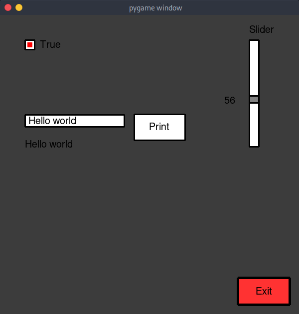

# Basic example

This is a very simple demonstration of how the widgets are used and how they look.

### Code

```python
########################################################################
# This example showcases a few widgets for the user to experiment with #
########################################################################


import pgui
import pygame
import sys

pygame.init()


class Main:
    def __init__(self):
        # Create a screen so we can display our widgets
        self.screen = pygame.display.set_mode((600, 600))

        # Create some widgets
        self.entry = pgui.Entry(self, func=self.clear, width=200)
        self.button = pgui.Button(self, func=sys.exit)
        self.print_button = pgui.Button(self, func=self.print_text, text="Print")
        self.slider = pgui.Slider(self, orientation="vertical")
        self.checkbox = pgui.CheckBox(self)

        # Modify some widget values
        self.button.set_label("Exit")
        self.button.bg_color = (255, 50, 50)
        self.checkbox.check_color = (255, 0, 0)
        self.entry.border_width = 3
        self.print_button.border_width = 3
        self.slider.border_width = 3
        self.slider.pointer_border_width = 3

        # Move the widgets to the location we want them to be
        self.entry.move(50, 200)
        self.button.move(480, 530)
        self.print_button.move(270, 200)
        self.slider.move(500, 50)
        self.checkbox.move(50, 50)

        self.font = pygame.font.SysFont("Arial", 20)

        # This is just a label we will later use to display the text of the entry
        self.entry_label = self.font.render(self.entry.text, 1, (0, 0, 0))

        # This is optional but we can but the widgets inside a list so we can
        # then iterate through it to update the widgets
        self.widgets = [self.entry, self.button, self.print_button, self.slider, self.checkbox]

    # Define some functions
    def print_text(self):
        # This will print the text typed in the Entry widget
        self.entry_label = self.font.render(self.entry.text, 1, (0, 0, 0))
        print(self.entry.text)

    def clear(self):
        # This will clear the text in the Entry widget
        self.entry.clear()

    def update(self):
        self.screen.fill((60, 60, 60))

        # Create two labels rendering the values of the the checkbox and the slider
        checkbox_label = self.font.render(str(self.checkbox.checked), 1, (0, 0, 0))
        slider_label = self.font.render(str(self.slider.mark), 1, (0, 0, 0))

        # Update each widget
        for w in self.widgets:
            w.update()

        # Display the checkbox label
        self.screen.blit(checkbox_label, (80, 50))

        # This line scales the value obtained from the slider to use it as a y-offset for the label,
        # that we can then use to display the label next to the slider pointer
        # (value / max_value ) * new_max_value + offset
        # That offset at the end of the formula is just a padding offset to make sure we are far away from the window's edge
        slider_label_y = (self.slider.mark/self.slider.max)*self.slider.get_length()+50

        # Display the slider label
        self.screen.blit(slider_label, (450, slider_label_y))

        self.screen.blit(self.entry_label, (50, 250))

        # Update the screen
        pygame.display.flip()

    # We can use a separate method for event handling
    def events(self):
        # The loop does not need to have anything in it but we
        # can use it however we want
        for event in pygame.event.get():
            if event.type == pygame.QUIT:
                raise SystemExit  # This is just the same as sys.exit()
            if event.type == pygame.KEYDOWN:
                if event.key == pygame.K_ESCAPE:
                    raise SystemExit  # This is just the same as sys.exit()


main = Main()
while True:
    main.update()
    main.events()
```

### Screenshot



---

[Go back to index](../../index.md)
